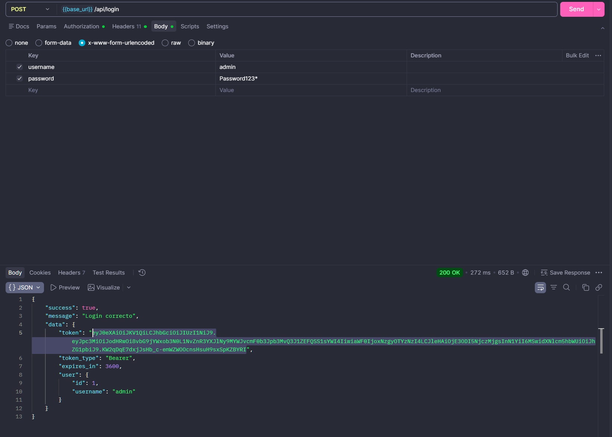
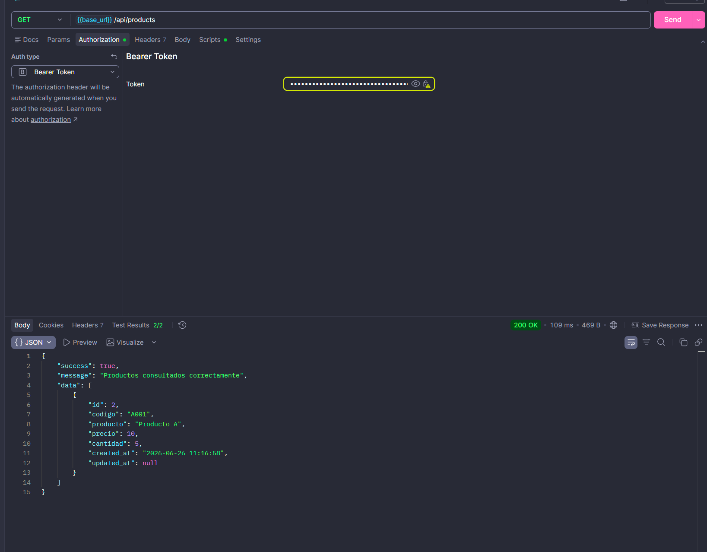
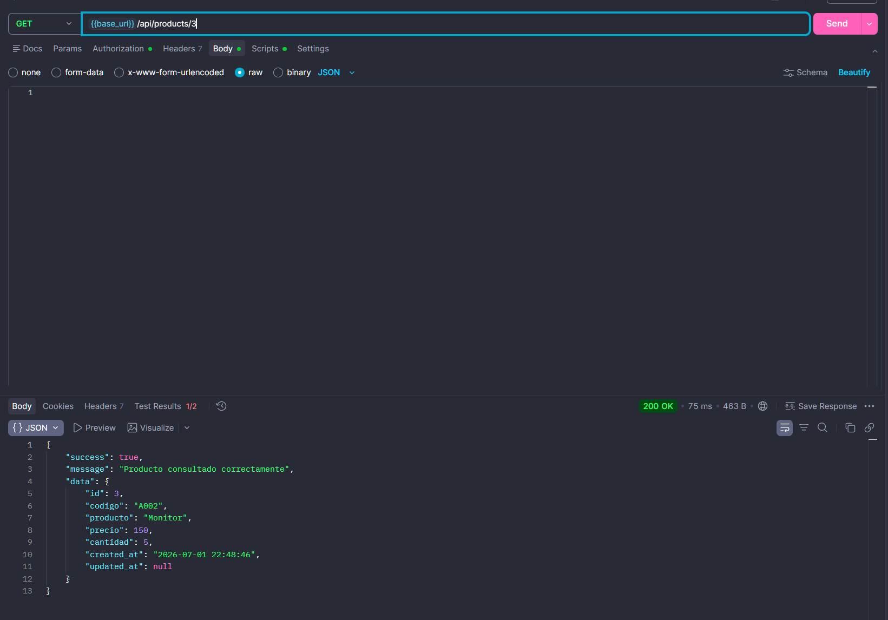
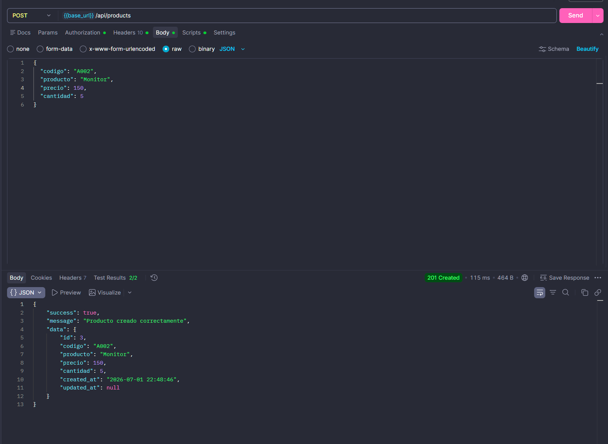
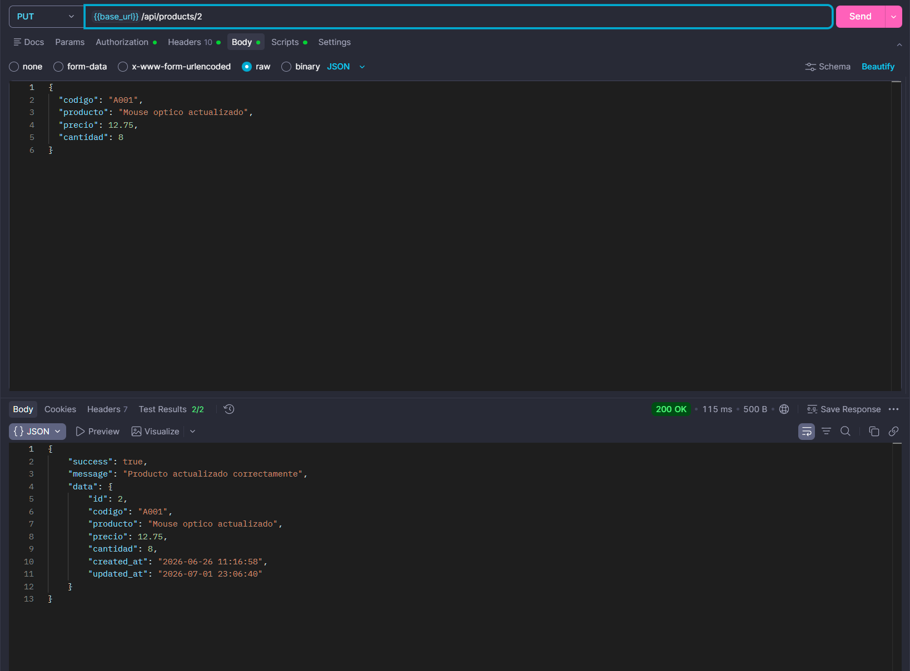
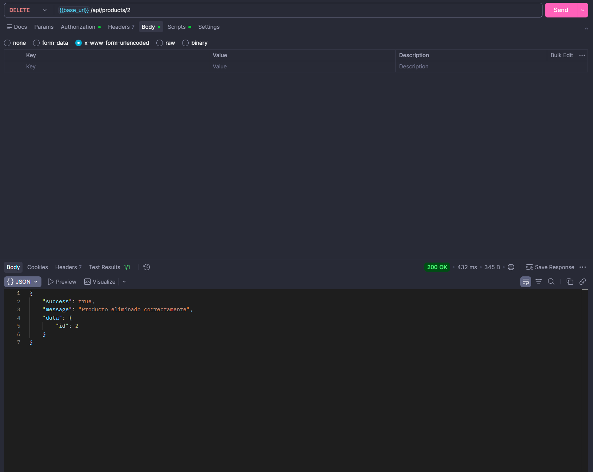
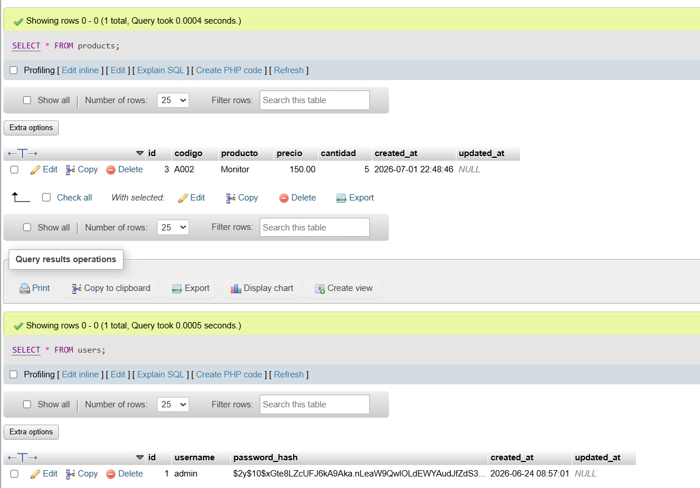

# Desarrollo y Pruebas de una API REST con PHP y Postman

## 1. Titulo del laboratorio

CrudAPI Lab 8: API REST con PHP puro, MySQL, PDO, Composer y JWT.

## 2. Descripcion

Este laboratorio implementa solamente una API REST. No utiliza interfaz web: todas las pruebas se hacen desde Postman. El endpoint `/api/login` genera un token JWT y las rutas de productos exigen `Authorization: Bearer TOKEN`.

## 3. Objetivos

- Crear una API REST sencilla con `GET`, `POST`, `PUT` y `DELETE`.
- Obtener un JWT mediante `/api/login`.
- Proteger productos con autenticacion stateless.
- Usar MySQL, PDO, consultas preparadas y JSON.
- Probar escenarios positivos y negativos con Postman.

## 4. Tecnologias utilizadas

PHP puro, MySQL, PDO, Composer, `firebase/php-jwt`, JSON, Apache con WAMP o XAMPP y Postman.

## 5. Requisitos

- PHP 8.0 o superior.
- MySQL o MariaDB.
- Composer.
- Apache con WAMP o XAMPP.
- Extension `pdo_mysql` habilitada.

## 6. Estructura del proyecto

```text
config/
database/
docs/images/
docs/postman/
public/
src/
```

La API entra por `public/index.php`. El CRUD vive en controladores y repositorios dentro de `src/`.

## 7. Instalacion de Composer

Desde la raiz del laboratorio:

```bash
composer install
composer dump-autoload
```

La carpeta `vendor/` no debe subirse al repositorio.

## 8. Configuracion del proyecto

Crear el archivo privado:

```bat
copy config\config.example.php config\config.php
```

Luego editar `config/config.php` con los datos locales de MySQL y una clave JWT privada de 32 caracteres o mas.

## 9. Creacion de la base de datos

Importar:

```text
database/database.sql
```

En phpMyAdmin se puede importar desde la pestana **Importar**. El SQL crea las tablas `users` y `products`, e inserta un usuario inicial:

```text
usuario: admin
contrasena: admin123
```

La contrasena queda guardada como hash Bcrypt, no como texto plano.

## 10. Configuracion del archivo privado

`config/config.php` debe contener:

- host, nombre, usuario y contrasena de MySQL.
- clave secreta JWT.
- tiempo de expiracion del token.
- issuer del laboratorio.

Ese archivo esta excluido en `.gitignore`.

## 11. Login por API

Endpoint:

```http
POST /api/login
```

Body:

```json
{
  "username": "admin",
  "password": "admin123"
}
```

Respuesta esperada:

```json
{
  "success": true,
  "message": "Login correcto",
  "data": {
    "token": "TOKEN_JWT",
    "token_type": "Bearer"
  }
}
```

## 12. Ejecucion en WAMP o XAMPP

Ruta base recomendada:

```text
http://localhost/Software7/Laboratorios/CrudAPI-lab8/public
```

Si Apache no acepta rutas limpias, usar:

```text
public/index.php?resource=products&id=1
```

## 13. Endpoints disponibles

| Metodo | Ruta                   | JWT | Descripcion        | Respuesta esperada |
| ------ | ---------------------- | --- | ------------------ | ------------------ |
| POST   | `/api/login`         | No  | Genera token       | 200 con token      |
| GET    | `/api/products`      | Si  | Lista productos    | 200                |
| GET    | `/api/products/{id}` | Si  | Consulta producto  | 200 o 404          |
| POST   | `/api/products`      | Si  | Crea producto      | 201                |
| PUT    | `/api/products/{id}` | Si  | Actualiza producto | 200 o 404          |
| DELETE | `/api/products/{id}` | Si  | Elimina producto   | 200 o 404          |

## 14. Uso del token JWT

Copiar `data.token` del login y enviarlo en Postman:

```text
Authorization: Bearer TOKEN_GENERADO
```

El token no se guarda en la base de datos.

## 15. Ejemplos de solicitudes JSON

Crear producto:

```json
{
  "codigo": "A001",
  "producto": "Mouse optico",
  "precio": 10.50,
  "cantidad": 5
}
```

Actualizar producto:

```json
{
  "codigo": "A001",
  "producto": "Mouse optico actualizado",
  "precio": 12.75,
  "cantidad": 8
}
```

## 16. Codigos de respuesta HTTP

- `200`: consulta, login, actualizacion o eliminacion correcta.
- `201`: producto creado.
- `400`: JSON invalido, ID invalido o datos incompletos.
- `401`: token ausente, invalido, alterado o expirado.
- `404`: ruta o producto inexistente.
- `405`: metodo HTTP no permitido.
- `409`: codigo de producto duplicado.
- `500`: error interno controlado.

## 17. Pruebas con Postman

Importar:

```text
docs/postman/API-REST-JWT.postman_collection.json
docs/postman/API-REST-JWT.postman_environment.json
```

Seleccionar el entorno `CrudAPI Lab8 Local` y revisar `base_url`.

## 18. Orden recomendado de pruebas

1. `01 Login correcto`.
2. `07 GET con token valido`.
3. `08 POST con token valido`.
4. `09 GET producto creado`.
5. `10 PUT producto`.
6. `14 POST con codigo duplicado`.
7. `11 DELETE producto`.
8. `12 GET producto inexistente`.
9. `03`, `04`, `05`, `06` sin token.
10. `13 POST con JSON invalido`.
11. `15 Solicitud con token alterado`.
12. `16 Solicitud con token expirado`.

## 19. Documentacion de clases y funciones

### `public/index.php`

- `routeParts()`: interpreta la ruta solicitada. Soporta rutas limpias como `/api/products/1` y tambien el formato alternativo `index.php?resource=products&id=1`.

### `App\Auth\AuthService`

- `__construct(array $config)`: recibe la configuracion JWT privada.
- `generateToken(array $user)`: genera un JWT firmado con `HS256`.
- `getExpiration()`: devuelve el tiempo de expiracion configurado.
- `getAuthorizationHeader()`: obtiene el encabezado `Authorization` desde Apache o PHP.
- `extractBearerToken($header)`: extrae el token del formato `Bearer TOKEN`.
- `validateToken($token)`: valida firma, expiracion y datos minimos del token.
- `userFromRequest()`: valida la solicitud actual y devuelve el usuario autenticado.

### `App\Controllers\AuthController`

- `__construct(UserRepository $users, AuthService $auth)`: recibe el repositorio de usuarios y el servicio JWT.
- `login(array $data)`: valida `username` y `password`, usa `password_verify()` y responde con el token JWT.

### `App\Controllers\ProductController`

- `__construct(ProductRepository $products)`: recibe el repositorio de productos.
- `index($id = null)`: lista todos los productos o consulta uno por ID.
- `store(array $data)`: valida e inserta un producto. Responde `201`.
- `update($id, array $data)`: valida y actualiza un producto existente.
- `destroy($id)`: elimina un producto existente.
- `validateProduct(array $data)`: valida campos obligatorios, precio, cantidad y datos vacios.
- `validId($id)`: comprueba que el ID sea entero positivo.

### `App\Database\Connection`

- `make(array $config)`: crea una conexion PDO con `ERRMODE_EXCEPTION`, `FETCH_ASSOC` y `utf8mb4`.

### `App\Exceptions\ApiException`

- `__construct($message, $statusCode, array $errors)`: crea un error controlado para la API.
- `getStatusCode()`: devuelve el codigo HTTP del error.
- `getErrors()`: devuelve detalles de validacion seguros para el cliente.

### `App\Http\JsonResponse`

- `success($message, $data, $status)`: envia una respuesta JSON exitosa.
- `error($message, $status, array $errors)`: envia una respuesta JSON de error.
- `send(array $payload, $status)`: establece el codigo HTTP, serializa JSON y termina la ejecucion.

### `App\Http\Request`

- `json()`: lee `php://input`, valida JSON vacio o mal formado y devuelve un arreglo.

### `App\Models\Product`

- `fromRow(array $row)`: normaliza una fila de producto, convirtiendo tipos numericos antes de responder.

### `App\Models\User`

- `publicData(array $row)`: devuelve datos publicos del usuario sin exponer `password_hash`.

### `App\Repositories\ProductRepository`

- `__construct(PDO $pdo)`: recibe la conexion PDO.
- `all()`: consulta todos los productos.
- `find($id)`: busca un producto por ID.
- `findByCodigo($codigo, $excludeId = null)`: busca duplicados por codigo.
- `create(array $data)`: inserta un producto con consulta preparada.
- `update($id, array $data)`: actualiza un producto con consulta preparada.
- `delete($id)`: elimina un producto con consulta preparada.

### `App\Repositories\UserRepository`

- `__construct(PDO $pdo)`: recibe la conexion PDO.
- `findByUsername($username)`: busca un usuario por nombre.
- `count()`: cuenta usuarios registrados.
- `create($username, $passwordHash)`: inserta un usuario con hash Bcrypt.

## 20. Evidencias y capturas

Login (se pone el token en la configuración de entorno de postman):



GET productos (obtener todos los productos):



GET especifico de un producto:



POST productos (crear producto):



PUT productos (actualizar):



DELETE (borrar un producto):



Tablas de la base de datos:



## 21. Errores comunes

- `vendor/autoload.php no encontrado`: ejecutar `composer install`.
- Extension PDO MySQL deshabilitada: habilitar `pdo_mysql`.
- Base de datos no creada: importar `database/database.sql`.
- Configuracion ausente: copiar `config/config.example.php` a `config/config.php`.
- Encabezado Authorization no recibido por Apache: revisar `.htaccess` o usar el campo Bearer Token de Postman.
- Token expirado: ejecutar `/api/login` otra vez.
- JSON invalido: revisar comas, llaves y `Content-Type: application/json`.
- Ruta base incorrecta en Postman: ajustar `base_url`.

## 22. Autores y grupo

Autores: André Reboulet y Rubén Dominguez

Grupo: 1GS131

Docente: Irina Fong

## 23. Conclusión General

En este laboratorio se aprendió a desarrollar y probar una API REST utilizando PHP, MySQL, PDO y Postman. También se comprendió el uso de los métodos HTTP para realizar operaciones CRUD, el intercambio de información mediante JSON y la protección de los endpoints con autenticación JWT. Además, se reforzaron conocimientos sobre consultas preparadas, códigos de respuesta HTTP, validación de datos y pruebas de escenarios correctos y de error. En general, el laboratorio permitió entender cómo funciona la comunicación segura entre un cliente y una API sin depender de una interfaz gráfica.
